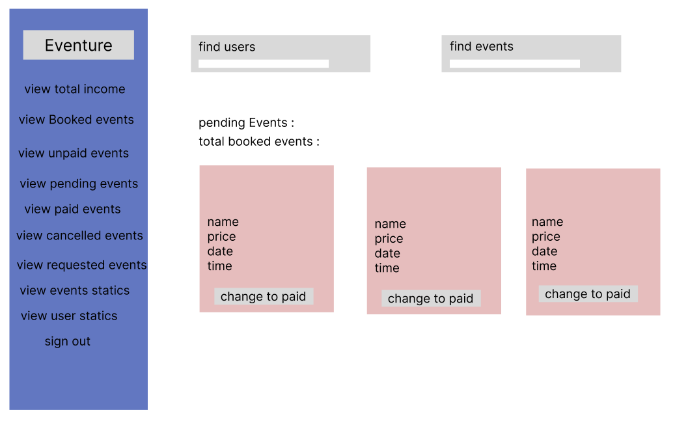

# Eventure-Backend!
# Eventure - Event Booking and Management System

Eventure is a user-friendly system that allows users to sign up, log in, create and edit their profiles, browse, book or cancel event bookings, and search for events in their country or on specific dates. Users can also add their own events to the system, and after admin approval, these events will be available for booking. Eventure sends email notifications to users when they book or cancel events. Additionally, the system provides an admin dashboard for managing users, events, statistics, and total income.

## Prerequisites

Eventure is built using the Java Spring framework, which includes various dependencies such as:
  - Lombok,
  - Spring Data JPA
  - Hibernate
  - Flyway Migration
  - Spring Security
  - Thymeleaf for the Front-End.
Ensure you have these dependencies set up before running the project.

## Configuration

Eventure is configured to allow all users to add, browse, and search for events. However, only authorized users can book or cancel events, view their profile pages, and access the "My Events" page, which contains all their booked events. Admins, as stored in the database, can access the admin dashboard.

## Database

Eventure uses the PostgreSQL database management system and includes eight tables:

1. `Address`: Stores event addresses.
2. `Address_country`: Maps events to specific countries.
3. `Event`: Stores booked events from the API.
4. `Events_requested_to_add`: Stores events added by users pending admin approval.
5. `Eventure_users`: Stores user data for registered users.
6. `Flyway_schema_history`: Manages database schema history for versioning.
7. `Location`: Stores venue names for events.
8. `Role_types`: Defines user roles as 'user' or 'admin'.

Relationships:
- One-to-Many: A user can book many events, one event can have many users, and one user can add many events.
- One-to-One: Relationships exist between `country`, `address`, and `location`. Each event is added by one user, and a user can have only one role.

## End-Points

- `/` : Home route for all users. 
- `/signup`: User can sign up and log-in through it. 
- `/aboutUs`: Brief about Eventure, and Developers who worked on.
- `/profile`: User can check his/her personal information.
- `/myEvents`: Shows the Events user has booked.
- `/contact`: Authenticated user can fill a form to add a new event. 
- `/events`: Search filter will show events based on the search criteria (Country/Date)
- `/terms-conditions`: Shows the terms & Conditions of our website. 
- `/adminHome`: Home route for an admin user. 

## API Documentation

Eventure fetches event data from the [Jambase API](https://www.jambase.com/jb-api/v1/events?apikey=357b5a27-55f2-487b-9b1c-83f6ad689c3e) to provide event information. The API is integrated into the Eventure backend via the Event Service, which retrieves necessary data for the system. The Jambase API offers search endpoints for countries and start dates.

## Security

Eventure uses Spring validation tools to validate user input. These validations include checking for duplicate usernames during sign-up, ensuring passwords meet specific criteria, and confirming that passwords match the confirm password field. Additionally, Eventure includes validation for the "Add Event" form to prevent users from adding duplicate events and to validate date fields.

## Wireframes

### User Interface

### Admin Dashboard

### View Booked Events

### View Unpaid Events

### View Paid Events

### View Pending Events

### View Canceled Events

### View Requested Events

### View Statistics

### View Total Income

